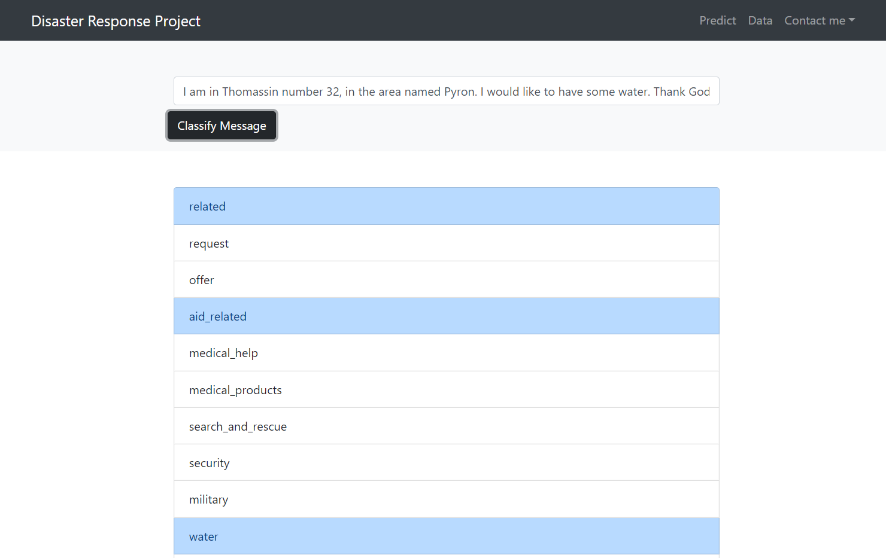
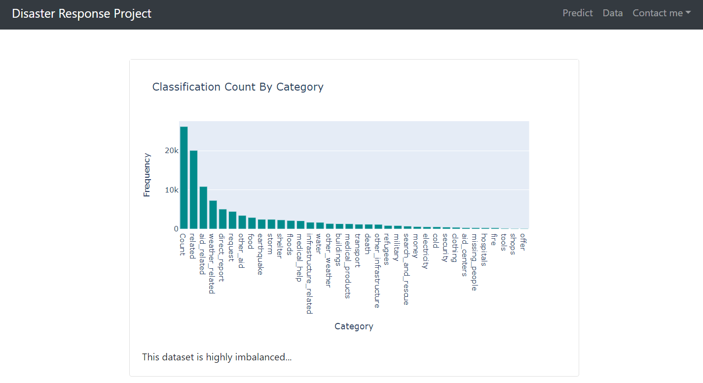

# Disaster Response Project

## Project Motivation
As part of a nanodegree at Udacity, this project deploys a webapp that helps classify messages that first responders get in a disaster to help organize the available resources.
## how to use it
1.- Download or clone project
2.- Run from the app folder with
> python run.py

after that you should be able to see the webapp from the url http://localhost:8050/

alternatively you can also use the data pipeline and ML pipeline used in this project to reload the data and retrain the model.

from the data folder run:
> python process_data.py disaster_messages.csv disaster_categories.csv DisasterResponse.db

and then from the models folder run
> train_classifier.py ../data/DisasterResponse.db model.pkl

## Folder Structure
```
📦app
 ┣ 📜app.py : Script with dash app object initialized
 ┣ 📜callbacks.py : Functions that update components based on user input, currently only message predictions
 ┣ 📜constants.py : Strings to be used throughout the project
 ┣ 📜data_utils.py : Functions for data loading
 ┣ 📜layouts.py : app layout using dash components
 ┣ 📜run.py : Main file that glues app, callbacks and layouts
 ┗ 📜utils.py : file with functions needed in order for pickle to be able to read model.pkl
 📦data
 ┣ 📜DisasterResponse.db : sqlite database
 ┣ 📜disaster_categories.csv : training messages classifications
 ┣ 📜disaster_messages.csv : training messages
 ┗ 📜process_data.py : Script with data pipeline to process and store messages in the db 
 📦models
 ┣ 📜model.pkl : saved model
 ┣ 📜train_classifier.py : Script with ML pipeline that prepares text data, trains a model on that data and saves the model
 ┗ 📜utils.py : file with functions needed for pickle to be able to save the model to be later loaded from other files
```

## Webapp screenshots



